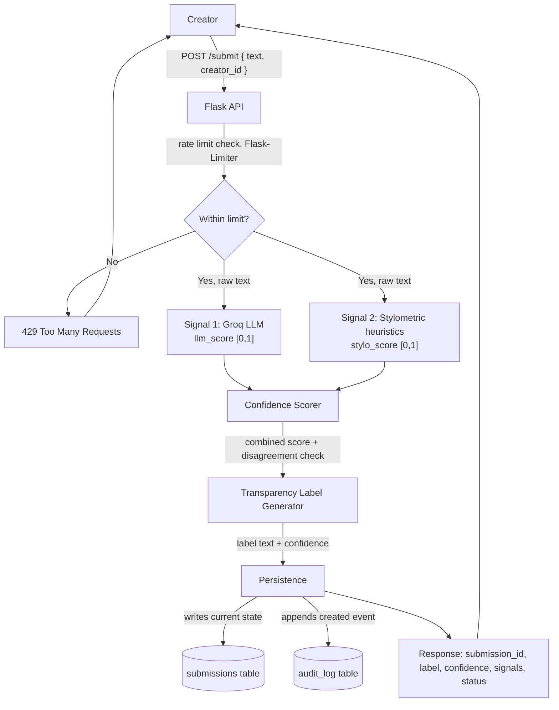
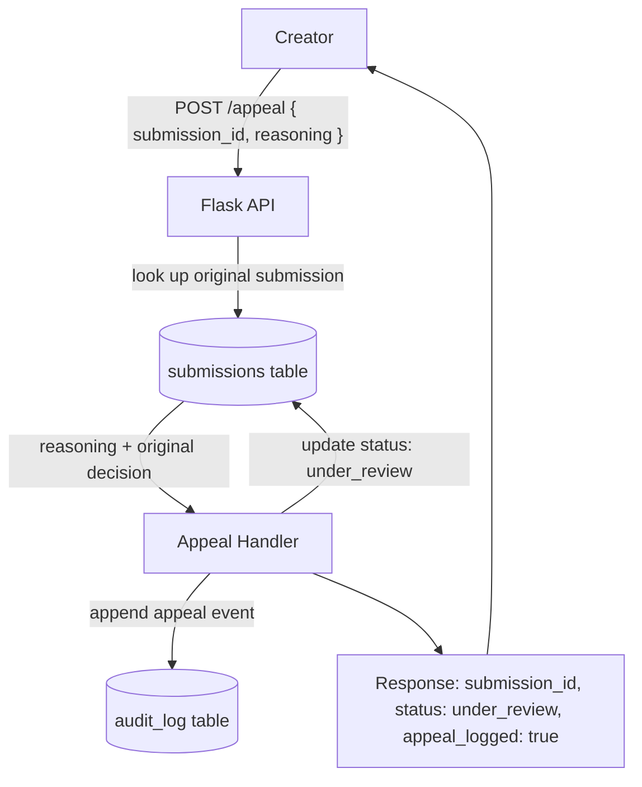

# Provenance Guard - Planning

## Milestone 1: Planning the Detection Pipeline

### 1. Architecture narrative: Path of a submission

A creator submits a piece of text-based content (poem, story excerpt, blog post) to
`POST /submit`. The request flows through (see `## Architecture` below for the
diagrammed version of both this flow and the appeal flow):

1. **API layer (Flask)**: validates the request body (non-empty text, within a max
   length), checks rate limit for the caller (Flask-Limiter), assigns a `submission_id`.
2. **Signal 1, LLM classifier (Groq, `llama-3.3-70b-versatile`)**: the raw text is
   sent to Groq with a prompt asking it to judge whether the text reads as
   human-written or AI-generated, returning a score in `[0,1]` (1 = confident AI).
3. **Signal 2, Stylometric heuristics (pure Python)**: the raw text is analyzed
   locally for sentence-length variance, type-token ratio (vocabulary diversity), and
   punctuation density, producing an independent score in `[0,1]` on the same scale.
4. **Confidence scorer**: combines the two signal scores into one combined confidence
   score using a weighted average with a disagreement override (see below), and
   buckets the result into one of three labels.
5. **Transparency label generator**: maps the label bucket and combined score into the
   exact user-facing text (see Milestone 2, Transparency label design).
6. **Persistence**: the submission's current state (id, text metadata, signal scores,
   combined score, label, status) is written to a `submissions` table, and a
   corresponding immutable event is appended to the `audit_log` table (submission id,
   signal scores, combined score, label, timestamp), *before* returning.
7. **Response**: the API returns the label text, combined confidence score, and the
   individual signal scores back to the caller.

Data model note: `submissions` is the mutable record of current state (status moves
from `classified` to `under_review`, etc). `audit_log` is an append-only trail of
events (submission created, appeal filed) and is never mutated, only added to. This
keeps "what is true right now" and "what happened, in order" cleanly separated.

Separately, a creator who disagrees with their classification calls `POST /appeal`
with their `submission_id` and reasoning text. This:

1. Looks up the original submission in the `submissions` table.
2. Updates that submission's status to `under_review` (no automated re-classification).
3. Appends an appeal event (submission id, creator reasoning, timestamp) to the
   `audit_log`.
4. Returns the updated status to the caller.

### 2. Detection signals

**Signal 1: LLM-based classification (Groq, `llama-3.3-70b-versatile`)**
- *What it measures:* holistic semantic and stylistic coherence: does the text read
  the way a human naturally writes (idiosyncrasy, imperfection, lived specificity), or
  does it show the smoothed-out, generically coherent patterns typical of LLM output?
- *Why it differs between human/AI:* the model has been trained on huge amounts of
  both human and AI text and can pick up on subtle global patterns (word choice,
  argument structure, "AI tells") that are hard to reduce to a simple formula.
- *Output shape:* a single float in `[0,1]` (1 = confident AI, 0 = confident human),
  produced by prompting Groq to return a score plus a one-line justification, and
  parsing the score out of the structured response.
- *Blind spot:* it's a black box, with no visibility into *why* it scored something a
  certain way. It can be fooled by heavily edited/paraphrased AI text or stilted human
  writing (e.g. non-native speakers, ESL writers, very formal writing), and it costs an
  API call per submission (latency + rate limits on Groq's side).

**Signal 2: Stylometric heuristics (pure Python, no external libraries)**
- *What it measures:* measurable statistical structure of the text: sentence-length
  variance, type-token ratio (vocabulary diversity), punctuation density, and average
  sentence complexity.
- *Why it differs between human/AI:* AI-generated text tends toward more *uniform*
  sentence lengths and more "average" vocabulary choices (regression to the mean of
  training data), while human writing tends to be more variable, mixing short and
  long sentences, using idiosyncratic punctuation, repeating pet words/phrases.
- *Output shape:* each of the four sub-metrics is normalized to `[0,1]` against fixed
  reference ranges (documented in code), then averaged into a single `stylo_score` in
  `[0,1]` (1 = looks AI-like, 0 = looks human-like).
- *Blind spot:* purely structural, it has no notion of meaning or coherence, so a
  human writer with a very uniform, controlled style (or an AI prompted to "write with
  varied sentence length") can easily fall on the wrong side. It's a weak signal alone,
  and it's unreliable on very short text (see Anticipated edge cases).

**Signal 3 (stretch, ensemble detection): stock AI-phrase density (pure Python)**
- *What it measures:* density of phrases widely documented as overused LLM "tells"
  ("it is important to note," "furthermore," "delve into," "leverage," "seamless,"
  etc.), counted per 100 words. Compiled from general AI-writing-detection discussion,
  not reverse-engineered from this project's own test samples.
- *Why it differs between human/AI:* unlike Signal 2, this doesn't measure formality
  or structure, it measures specific overused phrasing, so it can catch (or fail to
  catch) cases independently of whether the text is formal or casual.
- *Output shape:* a float in `[0,1]`. Presence of these phrases is treated as real
  evidence of AI-like phrasing and scales the score up toward 1; *absence* of matches
  returns a neutral `0.5` rather than `0.0`, since not using stock phrases is not, by
  itself, strong evidence of a human author (an AI sample written in a deliberately
  casual style was wrongly pulled toward "human" during testing when 0 matches scored
  as confidently human-like; scoring absence as neutral fixed that without introducing
  new errors, confirmed on a 15-sample held-out test set built after the initial
  design, not used to tune the lexicon or thresholds).
- *Blind spot:* it's a keyword list, trivially evaded by avoiding those exact phrases,
  and it actively backfires on genuine human corporate/marketing writing, which uses
  the same buzzwords ("leverage," "utilize," "robust," "seamless," "comprehensive")
  unironically. Confirmed during testing: a human-written corporate-style paragraph
  was misclassified as AI by this signal alongside the other two, not fixed by adding
  it (see Anticipated edge cases).

Signals 1 and 2 are genuinely independent: one is semantic/holistic (LLM), the other
is structural/statistical (stylometry). Signal 3 adds a third, lexical-pattern axis.
When signals agree, confidence is well earned; when they disagree, that disagreement
itself is informative (see confidence scoring). Adding Signal 3 was validated on a
15-sample test set (4 initial + 2 held-out + 9 new, spanning casual/formal/adversarial
human and AI text) before being wired in: it reduced confidently-wrong labels from
6/15 to 4/15 with no new regressions, but did not fully solve the formal-writing/
corporate-buzzword blind spot shared by all three signals (see Anticipated edge cases).

### 3. Confidence scoring approach

Each signal returns a score in `[0,1]` (1 = confident AI, 0 = confident human). A
confidence score is never treated as a strict probability; it is a relative measure of
"how AI-like the combined evidence looks," and what matters most is which of three
bands it falls into, not its precise value. A `0.51` and a `0.95` must produce visibly
different labels; a `0.51` should read as "essentially a coin flip," not "likely AI."

```
combined = 0.5 * llm_score + 0.3 * stylo_score + 0.2 * stock_score
disagreement = max(llm_score, stylo_score, stock_score) - min(llm_score, stylo_score, stock_score)

if disagreement > 0.40:
    label = "uncertain"   # signals conflict: don't let any one of them alone push
                          # to a confident verdict, regardless of where combined lands
else:
    label = label_from_thresholds(combined)   # see table below
```

Weights favor Signal 1 (0.5) as the most holistic check, with Signal 2 (0.3) and
Signal 3 (0.2) as structural/lexical moderators; disagreement is measured as the
full range across all three rather than a pairwise difference, so any one signal
diverging sharply from the other two is still enough to force "uncertain."

**Tuning methodology and results:** the weights, disagreement threshold, and label
thresholds were calibrated against a 17-sample labeled test set (`tests/eval_samples.py`:
7 AI, 10 human, spanning casual/formal/academic/corporate/adversarial text), evaluated
with `tests/eval_weights.py`. Starting point (0.5/0.3/0.2 weights, disagree=0.35,
AI>=0.70): 6 confidently correct, 4 confidently wrong (all human academic/legal/
corporate writing misclassified as AI), 7 uncertain. Two changes were validated by
comparing multiple configurations on this set, not by tuning a single knob in
isolation:
- Raising `AI_THRESHOLD` from 0.70 to 0.75 cut wrong labels from 4 to 1 with *no*
  loss in correct labels, since several genuine human samples landed at 0.72-0.75,
  just above the old bar. Alternatives tried and rejected: trusting Signal 1 more
  (0.65/0.2/0.15 weights) increased wrong labels to 6; loosening the disagreement
  threshold to 0.45 increased wrong labels to 5; equal-thirds weights with a
  tighter 0.25 disagreement threshold matched the 1-wrong result but at the cost
  of 2 fewer correct labels (over-cautious).
- Raising `DISAGREEMENT_THRESHOLD` from 0.35 to 0.40 (found via a grid search over
  both thresholds) recovered one more correct label with no new errors, by fixing
  a real interaction: `score_stock_phrases` returns a neutral `0.5` when it finds
  no stock phrases (deliberate design, see section 2), and at 0.35 that neutral
  abstention alone was enough to trigger the disagreement override even when the
  other two signals strongly agreed, incorrectly forcing "uncertain" on otherwise-
  clear AI samples.

Final result: 7 confidently correct, 1 confidently wrong, 9 uncertain. The one
remaining wrong case (`human_corporate_buzzword`) is not a tuning gap: its combined
score (0.86) is statistically indistinguishable from genuine AI samples in the same
test set (0.88-0.90), so no single threshold can separate it without also excluding
true positives. This is the same structural limitation as edge case 4/5 below, not
something a fourth grid search would fix. Because tuning was done against this same
17-sample set, these values are a validated starting calibration, not a final
answer, a larger, independently-collected dataset would be needed before trusting
them in a real deployment (see Open questions).

Label thresholds (asymmetric, biased against false AI accusations per the hint that a
false positive, human mislabeled as AI, is worse than a false negative), applied only
when the signals agree (disagreement <= 0.40):

| combined score | label               | meaning to a reader |
|-----------------|---------------------|----------------------|
| >= 0.75         | high-confidence AI  | "likely AI-generated" |
| <= 0.30         | high-confidence human | "likely human-written" |
| otherwise       | uncertain           | "we can't confidently tell" |

The `combined` score itself is always returned to the caller as the numeric
confidence, even when disagreement forces the label to "uncertain": the label
communicates the verdict, the score communicates how it was computed. Forcing the
label directly (rather than clamping the score into the uncertain range) avoids an
edge case where a clamped score could still land exactly on a threshold boundary and
get bucketed into a confident label despite the disagreement.

We only ever land in "high-confidence AI" when *both* signals independently agree the
text looks AI-generated. A single strong signal can't brand a human creator on its own.

**Testing that scores are meaningful:** before wiring signals into the endpoint, run
both signal functions directly against a small hand-built set of known-human and
known-AI text samples (see AI Tool Plan, M3/M4 verification steps) and confirm scores
separate the two groups rather than clustering near 0.5 regardless of input.

### 4. False-positive trace (human misclassified as AI)

*Note: this trace was written in Milestone 1, before Signal 3 was added and before
the section 3 thresholds were tuned in Milestone 4. The numbers below use the
original 2-signal formula and are kept as-is since they still correctly illustrate
the design intent; they are no longer the literal formula in production (see
section 3 for the current values and two now-confirmed real false-positive cases,
Anticipated edge cases 4 and 5).*

Scenario: a human writer submits a tightly-edited, very uniform blog post. The LLM
signal is uncertain (0.55, mildly polished but plausible either way) but the
stylometry signal spikes high (0.85, unusually uniform sentence lengths, since this
writer edits ruthlessly).

- `disagreement = |0.55 - 0.85| = 0.30`, below the 0.35 threshold, so the label is
  taken from the threshold table rather than forced.
- `combined = 0.6*0.55 + 0.4*0.85 = 0.67`, which falls in the **uncertain** band, not
  high-confidence AI. Good: the writer isn't branded, but they're also not fully
  cleared.
- The label shown is the "uncertain" variant: plain language, explicitly flags that
  the system isn't sure, and does not assert AI authorship.
- The audit log records both signal scores and the combined score, so if the creator
  files an appeal, the human reviewer can see why the system landed on uncertain
  (stylometry drove it, LLM was ambivalent), giving them concrete grounds to contest.
- On `POST /appeal`, the creator's reasoning ("I always edit my sentences to be
  tight and uniform") is logged next to the original decision, status flips to
  `under_review`, and a human makes the final call. No auto re-classification.

This shows the system's designed failure mode is "flag as uncertain and invite an
appeal," not "confidently misclassify," which matches the stated priority that false
positives are the worse failure.

### 5. API surface

**`POST /submit`**
- Accepts: `{ "text": string, "creator_id": string }`
- Returns: `{ "submission_id": string, "label": string, "confidence": float, "signals": { "llm_score": float, "stylo_score": float, "stock_score": float }, "status": "classified" }`
- Rate-limited per creator/IP.

**`POST /appeal`**
- Accepts: `{ "submission_id": string, "reasoning": string, "creator_id": string }`
- Returns: `{ "submission_id": string, "status": "under_review", "appeal_logged": true }`

**`GET /appeals`** (human reviewer queue)
- Accepts: none (maybe `?limit=n` query param)
- Returns: array of submissions with `status = under_review`, each including original
  text, label/confidence/signals, and appeal reasoning.

**`GET /log`** (audit log visibility)
- Accepts: none (maybe `?limit=n` query param)
- Returns: array of structured audit entries (submission id, signals, combined score,
  label, appeals if any, timestamps).

**`GET /submissions/{id}`**
- Accepts: path param `id`
- Returns: the stored submission record (text metadata, label, confidence, status).

## Architecture

**Submission flow:**



**Appeal flow:**



**Narrative:** a submission runs through both detection signals independently, the
confidence scorer combines them into one score and label, and the result is written
to `submissions` (current state) and `audit_log` (append-only trail) before it's
returned. An appeal skips re-classification entirely: it looks up the existing
submission, flips its status to `under_review`, and appends an appeal event to the
same audit log so a human reviewer has the full decision trail in one place.

## Milestone 2: Locking Down the Implementation Contract

### 6. Uncertainty representation

Covered above in Milestone 1, section 3 (Confidence scoring approach): the combined
score is a relative "how AI-like" measure rather than a strict probability, mapped to
three label bands via fixed thresholds, with a disagreement override that forces
"uncertain" when the two signals conflict rather than letting a weighted average paper
over real disagreement.

### 7. Transparency label design

Exact text shown to a reader for each of the three label variants (`{confidence}` is
the combined score formatted as a percentage):

**High-confidence AI:**
> "This content shows strong signals of AI generation ({confidence}% confidence).
> If you're the creator and believe this is wrong, you can appeal this classification."

**High-confidence human:**
> "This content shows no strong signals of AI generation ({confidence}% confidence)."

**Uncertain:**
> "We can't confidently tell whether this content is AI-generated or human-written
> ({confidence}% confidence). This isn't an accusation, it means our signals didn't
> agree. If you're the creator, you can appeal for a human review."

Design intent: plain language, no jargon, states confidence numerically so a 51% and
a 95% visibly differ, and only surfaces an appeal call-to-action on the two labels a
creator would actually want to contest (AI and uncertain), not on high-confidence
human. This is a first draft; revise after showing it to someone unfamiliar with the
project.

### 8. Appeals workflow

- **Who can submit:** the creator who owns the submission, identified by matching the
  `creator_id` on the appeal request against the `creator_id` stored on the
  submission. (No authentication system in scope for this project; `creator_id` is
  trusted as passed by the client, same as on `/submit`.)
- **What they provide:** `submission_id` and free-text `reasoning` explaining why they
  believe the classification is wrong (required, minimum length enforced so empty or
  trivial appeals are rejected).
- **What the system does on receipt:**
  1. Looks up the submission by id; 404 if it doesn't exist, 403 if `creator_id`
     doesn't match.
  2. Updates the submission's `status` from `classified` to `under_review`. No
     automated re-classification runs.
  3. Appends an appeal event to `audit_log` containing the submission id, the
     creator's reasoning, and a snapshot of the original decision (signals, combined
     score, label) so the full context travels with the appeal.
  4. Returns the updated status to the caller.
- **What a human reviewer sees when they open the appeal queue** (`GET /appeals`,
  see API surface): a list of submissions with `status = under_review`, each showing
  the original text, the original label/confidence/signal breakdown, the creator's
  appeal reasoning, and the timestamp the appeal was filed. Resolving an appeal
  (accepting or rejecting it) is out of scope for this project; the workflow ends at
  making the case visible for manual review.

### 9. Anticipated edge cases

Specific content types the system will likely handle poorly:

1. **Short-form poems with a repeated refrain and simple vocabulary** (e.g. a
   villanelle or nursery-rhyme-style piece). Stylometry will likely score this as
   AI-like: repetition drives type-token ratio down and line lengths are uniform by
   design, even though the repetition is a deliberate literary device, not a sign of
   AI generation. Mitigation: if the LLM signal recognizes the poetic form and scores
   it low, the resulting disagreement forces the label to "uncertain" rather than
   "high-confidence AI," so the poem isn't confidently mislabeled.

2. **Very short submissions** (roughly under 40 words / 2-3 sentences). Stylometric
   heuristics like sentence-length variance need multiple sentences to be meaningful;
   on very short text this signal is close to noise and can swing wildly on trivial
   wording changes. Mitigation: define a minimum length below which `stylo_score` is
   down-weighted or omitted, leaning more on the LLM signal alone, with the overall
   confidence explicitly reported as lower for short text.

3. **Non-native English (ESL) writing with plain grammar and constrained vocabulary.**
   The LLM signal may read simple, correct, low-idiom sentence structure as "generic"
   and AI-like, when it's actually a common feature of non-native fluent writing.
   Mitigation: this is exactly the kind of case the disagreement-based "uncertain"
   fallback exists for; stylometric variety (even simple sentences can vary in length
   and structure) can pull the combined verdict back from a confident AI label.

4. **Formal/academic writing, confirmed during Milestone 4 testing (not just
   predicted).** A genuine human academic paragraph on monetary policy was
   misclassified as "high-confidence AI." Unlike edge cases 1-3, the disagreement
   safety net does not help here, because both signals are fooled in the *same*
   direction: the LLM signal reads formal register as AI-like, and every
   stylometric sub-metric we tried (sentence-length variance, punctuation
   plainness, word length) also correlates with formality rather than
   authorship, so it doesn't act as an independent check for this case. Two
   mitigations were tried and rejected: dropping the word-length sub-metric
   didn't change the outcome (the remaining metrics are equally confounded by
   formality), and raising the "high-confidence AI" threshold only separated
   this case from a true positive by a 0.018 margin, too thin to be a robust
   general threshold rather than an overfit to one example. This is a real,
   unresolved blind spot, not a bug: distinguishing formal human writing from
   formal AI writing via structure alone is a known, hard, unsolved problem.
   The appeals workflow is the actual safety net for this failure mode, not
   further signal tuning.

5. **Human corporate/marketing writing that genuinely uses buzzwords** ("leverage,"
   "utilize," "seamless," "robust," "comprehensive"), confirmed while testing the
   Signal 3 addition. This is the same shape of problem as edge case 4 (a register
   that both humans and AI produce in a way none of our signals can tell apart), just
   surfacing through vocabulary instead of sentence structure: Signal 3 was added
   specifically to catch AI "tells" independent of formality, but it can't distinguish
   an AI generating buzzword-heavy copy from a human who writes that way natively,
   since the phrases themselves are genuinely common in real corporate writing. Not
   fixable by curating the phrase list further. Same mitigation as edge case 4: this
   is a real limitation to disclose, not a bug to chase, with appeals as the backstop.

## AI Tool Plan

**M3 (submission endpoint + first signal):**
I'll give Claude the `## Architecture` diagram, section 2 (Signal 1), and the
`POST /submit` entry in section 5 (API surface), and ask it to generate a Flask
skeleton with a `/submit` route (request validation only, confidence/label stubbed),
plus a standalone `classify_with_llm(text) -> float` function that calls Groq's
`llama-3.3-70b-versatile` the way section 2 describes. Before wiring that function
into the endpoint, I'll call it directly against 3-5 hand-picked known-human and
known-AI text samples and confirm the score is always in `[0,1]` and ranks the
known-AI samples meaningfully higher than the known-human ones.

**M4 (second signal + confidence scoring):**
I'll give Claude section 2 (Signal 2) and section 3 (Confidence scoring approach /
Uncertainty representation) and ask it to generate a `score_stylometry(text) -> float`
function per the Signal 2 description, plus the confidence scorer that combines
`classify_with_llm`'s Groq-based score with `score_stylometry`'s output using the
weighted average and disagreement override from section 3. I'll verify it myself by
running the combined scorer against known-AI, known-human, and the Anticipated edge
case samples (short poem, very short text), confirming scores vary meaningfully
instead of clustering at 0.5, and that the edge cases land in the "uncertain" band
rather than being confidently misclassified.

**M5 (production layer):**
I'll give Claude section 7 (Transparency label design), section 8 (Appeals workflow),
the `/appeal`, `/appeals`, and `/log` entries in section 5 (API surface), and the
`## Architecture` diagram (appeal flow), and ask it to generate the label generation
logic mapping each label bucket to its exact copy, the `POST /appeal` and
`GET /appeals` endpoints, rate limiting configuration, and structured audit logging.
I'll verify it by submitting enough requests to trigger the rate limit and confirm a
429 response, crafting inputs (or mocking Groq/stylometry scores) to reach all three
label variants and checking the copy matches this document exactly, and filing an
appeal to confirm the submission's status flips to `under_review` with both the
submission and appeal showing up correctly via `GET /log` and `GET /appeals`, with at
least 3 audit log entries visible overall.

## Open questions / to revisit in Milestone 2

- Exact Groq prompt wording for the LLM signal (needs testing against known
  human/AI samples to calibrate score meaning).
- Exact stylometric formula/weights within `stylo_score` (sentence-length variance vs.
  type-token ratio vs. punctuation density: how are these three sub-metrics combined
  into one score, and what are the reference ranges used for normalization?).
- Rate limit specific numbers (requests per minute/hour per creator): needs reasoning
  about realistic usage on a writing platform.
- Minimum length threshold for down-weighting `stylo_score` on short submissions
  (Anticipated edge case 2): exact word/sentence count cutoff still needs picking.
- Whether rate-limited (429) submission attempts should also get a lightweight
  audit_log entry (creator_id, timestamp, reason), for abuse-pattern visibility, even
  though they never reach the signals.
- Fallback behavior when the Groq API call fails or times out: fail the whole request
  (503) vs. fail open to stylometry-only scoring with the label forced to "uncertain"
  (leaning toward the latter, consistent with the "uncertain is safe" design).
- The combine weights (`0.5`/`0.3`/`0.2`) and label thresholds (`0.75`/`0.30`/`0.40`
  disagreement) in section 3 have been calibrated against real signal outputs (see
  section 3's tuning methodology), not left as initial guesses, but only against a
  17-sample hand-built test set. A larger, independently-collected labeled dataset
  would be needed before trusting these exact values in a real deployment, and the
  one confirmed unfixable case (corporate buzzword human writing, edge case 5) should
  be re-verified rather than assumed permanent as the system evolves.
